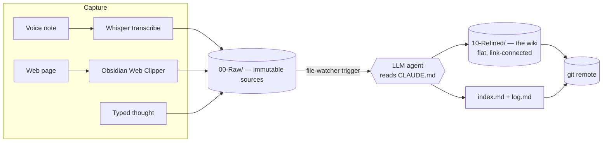

# obsidian-llm-wiki

**An agent-maintained personal knowledge base.** Raw inputs — voice notes, web clippings,
typed thoughts — flow in at one end; an LLM agent does all the tedious bookkeeping (reading,
summarising, cross-linking, indexing) and a clean, compounding wiki comes out the other end.
You curate and direct; the agent files.

It's built on plain Markdown in an [Obsidian](https://obsidian.md) vault, version-controlled
with git, and wired together with a small pipeline of local scripts. The whole "brain" — how
the agent thinks about your knowledge — lives in a single human-readable file,
[`CLAUDE.md`](CLAUDE.md), that you edit to evolve the system.

> **No vendor lock-in by design.** Everything is Markdown + git + shell. The LLM backend is
> swappable (a `claude -p` wrapper, an OpenAI/local-model call, GitHub Copilot CLI — anything
> that takes a file path and edits files). The repo ships **dormant**: nothing calls a model
> until you wire one in.

---

## The idea

Most note-taking dies from **maintenance cost**. You capture eagerly for a month, then the
filing, linking, and tidying outpace the value and the whole thing rots. This project's bet is
simple: **make maintenance cost ~zero by handing it to an agent**, so the knowledge actually
compounds.

The design splits the vault into three layers with one hard rule — **raw is immutable, refined
is the agent's**:



| Layer       | Folder               | Who owns it | Rule                                                                             |
| ----------- | -------------------- | ----------- | -------------------------------------------------------------------------------- |
| **Raw**     | `00-Raw/`            | inputs      | Immutable. Read-only source of truth. Organised by source, never topic.          |
| **Refined** | `10-Refined/`        | the agent   | The wiki. Flat. Held together by `[[wikilinks]]` + Maps of Content, not folders. |
| **Spine**   | `index.md`, `log.md` | the agent   | A catalog of every page and an append-only timeline of every operation.          |

The full schema — page types, frontmatter, naming, linking rules, and the ingest/query/lint
operations the agent runs — is documented in [`CLAUDE.md`](CLAUDE.md). That file _is_ the
system; read it to understand how the agent behaves.

---

## What's in this repo

```
CLAUDE.md                     the schema / agent brain (read this first)
index.md, log.md              the catalog and the timeline (example versions included)
00-Raw/                       immutable inputs (Inbox / Voice / Clippings / Archive / assets)
10-Refined/                   the agent-built wiki (example pages + MOCs included)
pipeline/
  ingest_one.sh               headless single-source ingest (DORMANT by default)
  lint_pass.sh                periodic health-check pass (DORMANT by default)
  vault_autocommit.sh         commit + sync device edits (the server is the only git brain)
  transcribe_new.sh           transcribe new voice clips (faster-whisper + ffmpeg denoise)
  backfill_transcribe.py      bulk/idempotent transcription with a sha256 ledger
  selftest_ingest.sh          non-destructive safety self-test for the ingest scaffold
  n8n/                        optional file-watcher automation (Docker + workflow template)
  systemd/                    optional user timers (lint / autocommit / transcribe)
config/                       Obsidian Web Clipper template
SETUP.md                      from-scratch setup guide
TROUBLESHOOTING.md            the gotchas you'll actually hit
.env.example                  the placeholders the pipeline reads
```

The `00-Raw/` and `10-Refined/` folders ship with a small **synthetic example vault** (clearly
fictional) so you can see the shape of inputs and the pages an agent produces from them.

---

## How the pipeline works

1. **Capture.** A voice note syncs to a server; a web page is clipped; a thought is typed into
   the Inbox. All land in `00-Raw/`.
2. **Transcribe** (voice only). `transcribe_new.sh` runs faster-whisper (with an ffmpeg
   denoise pass) over new clips and writes a transcript into `00-Raw/Voice/`. A sha256 ledger
   makes it idempotent.
3. **Ingest.** A new file in `00-Raw/` triggers `ingest_one.sh`, which runs the agent over
   that one source following the `CLAUDE.md` Ingest workflow — writing/updating the Refined
   pages, stubs, links, MOCs, `index.md`, and `log.md` — then commits _one source per commit_.
4. **Sync.** `vault_autocommit.sh` commits device edits and pushes; the server is the single
   git authority so editing devices never run git.
5. **Lint** (weekly). `lint_pass.sh` runs the agent's health-check: orphans, contradictions,
   stale stubs, missing cross-references.

### Safety: dormant by default

The two agent-driven scripts (`ingest_one.sh`, `lint_pass.sh`) are **no-ops until you set
`INGEST_CMD`** to a model backend. Until then an accidental trigger can't write a partial page
or commit anything. Locking (a presence lock + an `flock` single-runner guard) prevents the
auto-commit timer from ever committing a half-written page, and stops two ingests overlapping.
Run `pipeline/selftest_ingest.sh` to verify the safety behaviour without writing anything.

---

## Quick start

```bash
git clone https://github.com/<you>/obsidian-llm-wiki.git
cd obsidian-llm-wiki

# 1. Open the folder as a vault in Obsidian (and read CLAUDE.md).
# 2. Copy and fill in the environment placeholders.
cp .env.example .env        # edit: VAULT_ROOT, SERVER_IP, INGEST_CMD, ...

# 3. Prove the scaffold is safe (writes nothing, makes no commit):
bash pipeline/selftest_ingest.sh
```

To go further — local voice transcription, automatic ingest on capture, scheduled lint, and
the optional n8n file-watcher — follow [`SETUP.md`](SETUP.md). The pitfalls worth knowing
before you start are in [`TROUBLESHOOTING.md`](TROUBLESHOOTING.md).

---

## Tools used

| Tool                                                                                            | Role                                                                   |
| ----------------------------------------------------------------------------------------------- | ---------------------------------------------------------------------- |
| [Obsidian](https://obsidian.md)                                                                 | Markdown vault / editor (Dataview-friendly frontmatter)                |
| **git**                                                                                         | version control + the sync backbone (the server is the only git brain) |
| **An LLM agent**                                                                                | the maintainer — swappable backend behind `INGEST_CMD`                 |
| [faster-whisper](https://github.com/SYSTRAN/faster-whisper)                                     | local, free voice-to-text                                              |
| **ffmpeg**                                                                                      | audio denoise/normalise before transcription                           |
| **bash + systemd user timers**                                                                  | the glue and the schedule                                              |
| [n8n](https://n8n.io) _(optional)_                                                              | no-code file-watcher that triggers ingest on capture                   |
| A sync transport (e.g. [SyncThing](https://syncthing.net) / [Tailscale](https://tailscale.com)) | moves captures from phone to server privately                          |

---

## Roadmap

- [x] **Core schema** (`CLAUDE.md`) + three-layer architecture
- [x] **Ingest / lint / autocommit / transcribe** pipeline scripts (dormant scaffold)
- [x] **Voice pipeline** — faster-whisper + ffmpeg denoise + idempotent ledger
- [ ] **Automatic ingest on capture** — wire a model backend into `INGEST_CMD` and enable the
      file-watcher trigger (n8n workflow template + systemd units included, shipped disabled)
- [ ] **Agentic query/search** — ask the wiki questions and file good answers back as pages

---

## License

[MIT](LICENSE) © Will Douglas.

The `00-Raw/` and `10-Refined/` content in this repo is **synthetic example data** for
illustration — it is not a real personal knowledge base.
